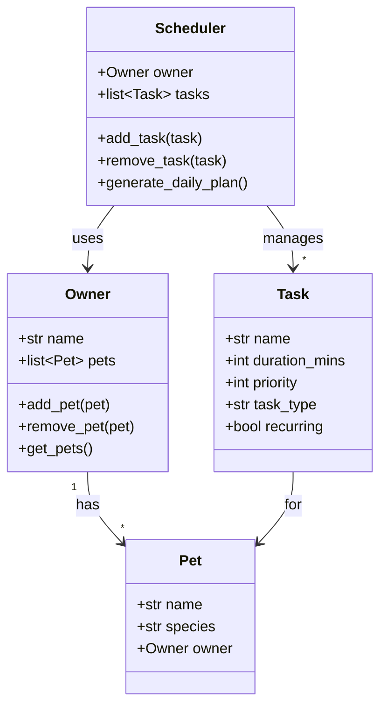

# PawPal+ Project Reflection

## 1. System Design

Three core actions a user should be able to perform:

1. Enter or add basic owner and pet information.
2. Add and edit pet care tasks (at minimum duration and priority).
3. Generate and view today's plan and see why that plan was chosen.

UML (Mermaid.js class diagram):

**a. Initial design**

- Owner: Stores name and list of pets; adds, removes, and returns pets.
- Pet: Stores name, species, and owner reference (dataclass).
- Task: Stores name, duration_mins, priority, task_type, recurring flag, and pet reference (dataclass).
- Scheduler: Stores owner and task list; adds tasks, removes tasks, and generates the daily plan.

**b. Design changes**

- Did your design change during implementation?
- If yes, describe at least one change and why you made it.

---

## 2. Scheduling Logic and Tradeoffs

**a. Constraints and priorities**

- What constraints does your scheduler consider (for example: time, priority, preferences)?
- How did you decide which constraints mattered most?

**b. Tradeoffs**

- The conflict detector only flags tasks that share the same start time (e.g. both at 08:00). It does not detect overlaps when start times differ but durations cross over (e.g. one task 08:00–08:30 and another 08:15–08:25).
- I chose this so the logic stays simple and we avoid flagging back to back tasks that are intentionally stacked. For a daily pet-care list, the main problem is two things at the same slot, not every possible minute of overlap. matches how we use it for a daily list, where the same start time is what matters. If we ever needed to catch every overlapping minute, we’d have to change the detector to compare start and end times instead of just the start time.

---

## 3. AI Collaboration

**a. How you used AI**

- How did you use AI tools during this project (for example: design brainstorming, debugging, refactoring)?
- What kinds of prompts or questions were most helpful?

**b. Judgment and verification**

- Describe one moment where you did not accept an AI suggestion as-is.
- How did you evaluate or verify what the AI suggested?

---

## 4. Testing and Verification

**a. What you tested**

- What behaviors did you test?
- Why were these tests important?

**b. Confidence**

- How confident are you that your scheduler works correctly?
- What edge cases would you test next if you had more time?

---

## 5. Reflection

**a. What went well**

- What part of this project are you most satisfied with?

**b. What you would improve**

- If you had another iteration, what would you improve or redesign?

**c. Key takeaway**

- What is one important thing you learned about designing systems or working with AI on this project?
