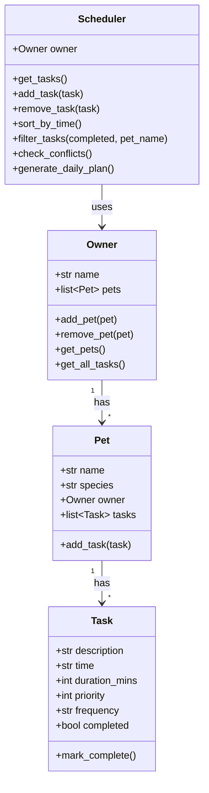

# PawPal+ Project Reflection

## 1. System Design

Three core actions a user should be able to perform:

1. Enter or add basic owner and pet information.
2. Add and edit pet care tasks (at minimum duration and priority).
3. Generate and view today's plan and see why that plan was chosen.

UML (Mermaid.js class diagram):

**a. Initial design**

- Owner: Stores name and list of pets; adds, removes, and returns pets.
- Pet: Stores name, species, and owner reference (dataclass).
- Task: Stores name, duration_mins, priority, task_type, recurring flag, and pet reference (dataclass).
- Scheduler: Stores owner and task list; adds tasks, removes tasks, and generates the daily plan.

**b. Design changes**

- Did your design change during implementation?
- If yes, describe at least one change and why you made it.

---

## 2. Scheduling Logic and Tradeoffs

**a. Constraints and priorities**

- What constraints does your scheduler consider (for example: time, priority, preferences)?
- How did you decide which constraints mattered most?
- The scheduler considers time (tasks ordered by start time), priority (stored per task), and which pet each task belongs to. I treated time as the most important constraint because a daily schedule needs a chronological plan the owner can follow. Priority and pet are secondary since they matter for deciding which tasks to include or highlight (ex, high-priority items or tasks for a specific pet), but they don’t override the basic rule that the day should be laid out in time order.

**b. Tradeoffs**

- The conflict detector only flags tasks that share the same start time (e.g. both at 08:00). It does not detect overlaps when start times differ but durations cross over (e.g. one task 08:00–08:30 and another 08:15–08:25).
- I chose this so the logic stays simple and we avoid flagging back to back tasks that are intentionally stacked. For a daily pet-care list, the main problem is two things at the same slot, not every possible minute of overlap. If we ever needed to catch every overlapping minute, we’d have to change the detector to compare start and end times instead of just the start time.

---

## 3. AI Collaboration

**a. How you used AI**

- How did you use AI tools during this project (for example: design brainstorming, debugging, refactoring)?
- What kinds of prompts or questions were most helpful?
- AI was used for design brainstorming, implementing methods for a demo script, and drafting test functions. The most helpful prompts were concrete ones that gave Copiolt an exact file or behavior (e.x "how should the Scheduler retrieve all tasks from the Owner's pets?").

**b. Judgment and verification**

- Describe one moment where you did not accept an AI suggestion as-is.
- How did you evaluate or verify what the AI suggested?
- During phase 4, the AI suggested logic improvements that could make the scheduling app more efficient for a pet owner. Some of those ideas were drastic and would have changed the code a lot. I rejected several of them because they felt unnecessary for what I was trying to build. When I wasn’t sure about a suggestion, I asked the AI to explain why it thought the change was a good idea and what problem it was solving. That helped me see the reasoning and then decide whether the benefit was worth the extra complexity, so I could accept or reject based on understanding.

---

## 4. Testing and Verification

**a. What you tested**

- What behaviors did you test?
- Why were these tests important?
- Task completion status, adding tasks to a pet, sorting by time, daily recurrence (next-day task created on mark complete), conflict detection for duplicate times, and a pet with no tasks (empty schedule with no conflicts). These tests matter because they verify the core scheduling behavior so changes to the logic don’t change the projects goals.

**b. Confidence**

- How confident are you that your scheduler works correctly?
- What edge cases would you test next if you had more time?
- My confidence for the backend is 4.5/5. The UI is not covered by automated tests so next would be tests for weekly recurrence, filter_tasks by pet/completion, and remove_task/remove_pet.

---

## 5. Reflection

**a. What went well**

- What part of this project are you most satisfied with?
Testing the scheduler with main.py and pytest first meant I knew the core behavior was correct before adding the UI. That made debugging easier and kept the integration step simple.

**b. What you would improve**

- If you had another iteration, what would you improve or redesign?
- Add tests for filtering and weekly recurrence.

**c. Key takeaway**

- What is one important thing you learned about designing systems or working with AI on this project?
- Working with AI on this project, I learned its important to have control in deciding what to build and what to reject. AI is strong at generating code and tests, but its important to verify that the  suggestions match the system you have in mind and that you do not blindly accept the AI outputs.

